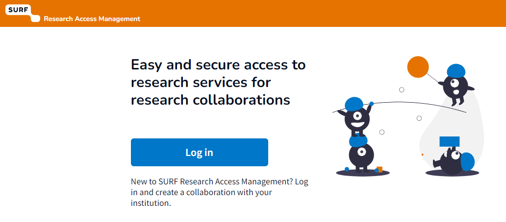
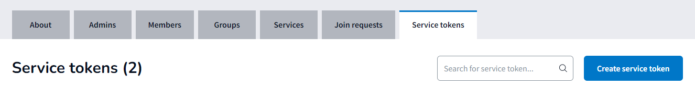

---
# Feel free to add content and custom Front Matter to this file.
# To modify the layout, see https://jekyllrb.com/docs/themes/#overriding-theme-defaults
layout: default
title: irods@tudelft
nav_order: 1
---
# irods@tudelft

irods@tudelft provides tools for data management

<details open markdown="block">
  <summary>
    Table of contents
  </summary>
  {: .text-delta }
- TOC
{:toc}
</details>

## Before connecting to iRODS

Before you can connect to iRODS, you need to make iRODS aware of your existence. This is done through a number of (one-time) steps. 

### Requesting access

@TODO@

- Get yourself in irods collaboration

#### One-time-action: Creating a SRAM token:

- Go to <https://sram.tudelft.nl> and click login:



- Select your institute (chances are that it is Delft University of Technology) and login with your credentials and (likely) a second factor.

- Select the tab "Collaborations" and then the line "TU Delft iRods". If this is your first encounter with SRAM, it is likely that you are enrolled in only one collaboration.

- Click on the tab "Service tokens" and then on the button "Create service token"


- Make sure you copy the service token that is displayed in to your password manager (you have one right?) and give the token a name and then click "Save". After clicking save you will never be able to retrieve the actual token again (if you forget it you can create a new one).

## Connecting to iRODS through icommands

### Creating your iRODS environment file

```json
{
"irods_client_server_negotiation": "request_server_negotiation",
"irods_encryption_algorithm": "AES-256-CBC",
"irods_encryption_key_size": 32,
"irods_encryption_num_hash_rounds": 16,
"irods_encryption_salt_size": 8,
"irods_port": 1247,
"irods_host": "irods.tudelft.nl",
"irods_zone_name": "tud"
}
```

### Running iinit 